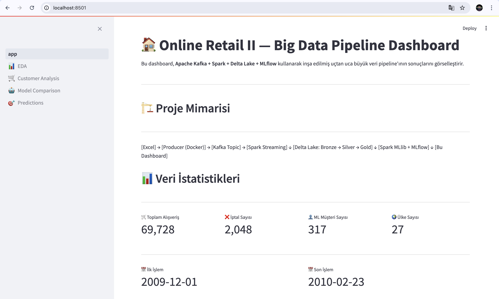

# Big Data Pipeline: Online Retail II — Customer Lifetime Value Prediction

End-to-end büyük veri projesi. **Apache Kafka** ile streaming veri üretimi, **Apache Spark** ile veri işleme, **Delta Lake** ile çok katmanlı depolama (Medallion mimarisi), **Spark MLlib** ile 5 farklı regresyon modeli, **MLflow** ile deney takibi ve **Streamlit** ile interaktif dashboard.



## 📌 Proje Hakkında

Bu proje **Bilgisayar Mühendisliği "Büyük Veri Analizine Giriş"** dersi 2025-2026 Bahar dönemi proje çalışmasıdır.

**Problem Tipi:** Regresyon (Denetimli öğrenme)  
**Hedef:** Müşteri Yaşam Boyu Değeri (Customer Lifetime Value) tahmini  
**Veri Seti:** [Online Retail II — UCI Repository](https://archive.ics.uci.edu/dataset/502/online+retail+ii)

### 🎯 Hızlı Sonuçlar

| Metric | Değer |
|--------|-------|
| En İyi Model | **Linear Regression** |
| R² Score | **0.66** (varyansın %66'sını açıklıyor) |
| RMSE | £1596 |
| MAE | £677 |
| Eğitilen Model Sayısı | 5 |
| Üretilen Feature Sayısı | 10 |
| Pipeline Faz Sayısı | 10 |

## 🏗️ Mimari

[Excel Veri Seti]
↓
[Python Producer] (Docker) ──► [Kafka Topic] (Docker) ──► [Spark Streaming] (Host)
↓
[Delta Lake: Bronze → Silver → Gold] (Host)
↓
[Spark MLlib + MLflow]
↓
[Streamlit Dashboard]

> **Not:** Apple Silicon (M1/M2/M3) üzerinde Spark, Docker amd64 emülasyonu nedeniyle kararsız çalışır. Bu projede Spark **host'ta (yerel sanal ortamda)** çalıştırılır — proje yönergesi "yerel Spark kurulumu da kabul edilir" dediği için bu yaklaşım hem kabul edilebilir hem de daha performanslıdır (~15× hız iyileşmesi).

## 🛠️ Kullanılan Teknolojiler

| Katman | Teknoloji | Sürüm | Konum |
|--------|-----------|-------|-------|
| Konteynerizasyon | Docker, Docker Compose | latest | - |
| Streaming | Apache Kafka (Confluent) | 7.5.0 | Docker |
| İşleme | Apache Spark (PySpark) | 3.5.1 | Host (sanal ortam) |
| Depolama | Delta Lake | 3.2.0 | Host |
| ML | Spark MLlib | 3.5.1 | Host |
| Deney Takibi | MLflow | 2.13.0 | Docker |
| Dashboard | Streamlit + Plotly | 1.35 + 5.22 | Host |
| Dil | Python | 3.10 | - |

## 👤 Geliştirici Ekip

- Tuna Kömür
- Kader Kırçiçek
- Osman Aldemir
- Yaren Güner

## 🚀 Kurulum

### Ön Gereksinimler

- macOS veya Linux
- Docker Desktop (en az 8 GB RAM, 4 CPU)
- Python 3.10
- Java 17
- Git

### Adımlar

**1. Repoyu klonla:**
```bash
git clone https://github.com/TunaKomur/big-data-online-retail-pipeline.git
cd big-data-online-retail-pipeline
```

**2. Java 17'yi kur (Homebrew):**
```bash
brew install openjdk@17
```

**3. Sanal ortam oluştur ve etkinleştir:**
```bash
python3.10 -m venv .venv
source .venv/bin/activate
```

**4. Java 17'yi sanal ortama bağla** (sanal ortam aktive dosyasına ekle):
```bash
echo 'export JAVA_HOME=/opt/homebrew/opt/openjdk@17' >> .venv/bin/activate
echo 'export PATH=$JAVA_HOME/bin:$PATH' >> .venv/bin/activate
deactivate && source .venv/bin/activate
```

**5. Python paketlerini yükle:**
```bash
pip install --upgrade pip
pip install -r requirements.txt
```

> ⚠️ **Olası setuptools sorunu:** MLflow 2.13, `pkg_resources` modülüne bağımlıdır. setuptools 81+ sürümlerinde bu modül kaldırıldı. Sorun yaşarsanız:
> ```bash
> pip install "setuptools<81"
> ```

**6. JAR dosyalarını indir** (Spark'ın Kafka ve Delta Lake ile iletişimi için):
```bash
./scripts/download_jars.sh
```

**7. Çevre değişkenlerini ayarla:**
```bash
cp .env.example .env
```

**8. Veri setini indir:**
- https://archive.ics.uci.edu/dataset/502/online+retail+ii adresinden ZIP indir
- `online_retail_II.xlsx` dosyasını `data/raw/` klasörüne koy

**9. Docker servislerini başlat:**
```bash
docker compose up -d
```

İlk çalıştırmada container imajları indirilir (5-10 dk).

**10. Kafka topic'ini oluştur:**
```bash
docker exec -it kafka kafka-topics \
  --create \
  --topic online-retail-transactions \
  --bootstrap-server kafka:9092 \
  --partitions 3 \
  --replication-factor 1 \
  --if-not-exists
```

**11. JupyterLab'i başlat (host'ta):**
```bash
jupyter lab --notebook-dir=. --no-browser
```

Terminal'de gösterilen URL'yi tarayıcıda aç.

### 🌐 Erişim Linkleri

| Servis | URL | Notlar |
|--------|-----|--------|
| Jupyter Lab | http://localhost:8888 | Geliştirme notebook'ları |
| Kafka UI | http://localhost:8080 | Topic ve mesaj yönetimi |
| MLflow | http://localhost:5001 | Deney takibi, model artifact'leri |
| Spark UI | http://localhost:4040 | Sadece Spark çalışırken |
| Streamlit Dashboard | http://localhost:8501 | `streamlit run dashboard/app.py` sonrası |

### Servisleri Durdurma

```bash
# Jupyter: Ctrl+C
# Streamlit: Ctrl+C
# Docker:
docker compose down
```

## 🐳 Servis Mimarisi (Docker)

| Servis | Container | Port | Görev |
|--------|-----------|------|-------|
| Zookeeper | `zookeeper` | 2181 | Kafka koordinasyonu |
| Kafka | `kafka` | 9092 (iç), 9094 (host) | Mesaj kuyruğu |
| Kafka UI | `kafka-ui` | 8080 | Web yönetim arayüzü |
| Producer | `producer` | - | JSON mesaj üretici |
| MLflow | `mlflow` | 5001 | Deney takibi |

Spark, JupyterLab ve Streamlit host'ta (sanal ortamda) çalışır.

## 📡 Kafka Producer (Faz 3)

Producer container'ı Excel veri setini okuyup her satırı **JSON mesaj** olarak Kafka topic'ine gönderir. Her mesaj proje yönergesinin gerektirdiği zorunlu alanları içerir: `timestamp`, `kullanici_ID`, `olay_tipi`, `ilgili_ID`.

### Kafka Topic Yapılandırması

- **İsim:** `online-retail-transactions`
- **Partition:** 3 (paralel okuma için)
- **Replication Factor:** 1

### Çalıştırma Modları

```bash
# Test modu (100 mesaj, yavaş — debug için)
docker exec -e MAX_MESSAGES=100 -e PRODUCER_RATE_PER_SECOND=20 \
  -it producer python /app/kafka_producer.py

# Demo modu (10.000 mesaj)
docker exec -e MAX_MESSAGES=10000 -it producer python /app/kafka_producer.py

# Bu projede kullanılan (100.000 mesaj)
docker exec -e MAX_MESSAGES=100000 -e PRODUCER_RATE_PER_SECOND=500 \
  -it producer python /app/kafka_producer.py

# Tam dataset (sınırsız — ~1M+ mesaj)
docker exec -it producer python /app/kafka_producer.py
```

> 💡 **Bu projede neden 100K mesaj örneklemi?** Streaming senaryosunu göstermek için yeterli, üretim zamanını da makul tutar. Pipeline tam dataset ile aynen çalışabilir; sadece daha çok zaman ve disk alanı gerektirir.

## 🌊 Spark Streaming + Delta Lake (Faz 4)

Kafka'dan gelen veriyi okuyup **Bronze/Silver/Gold** Medallion mimarisiyle Delta Lake'e yazar.

### Mimari

Kafka → Bronze (raw)    → Silver (clean)         → Gold (Faz 6)
↓                 ↓
delta/bronze/     delta/silver/
├── transactions/
└── cancellations/

| Katman | Görev | Çıktı |
|--------|-------|-------|
| **Bronze** | Raw streaming — Kafka mesajları ham haliyle | ~100K satır |
| **Silver** | Temizlik + tip dönüşümleri + purchase/cancellation ayrımı | ~85K + ~3K |
| **Gold** | Müşteri seviyesine agregasyon — feature tablosu | 317 müşteri |

### Notebook'lar

| Notebook | Görev |
|----------|-------|
| `01_bronze_streaming.ipynb` | Kafka → Delta Bronze (streaming) |
| `02_silver_transformation.ipynb` | Bronze → Silver (batch temizlik) |
| `03_delta_inspection.ipynb` | Tabloları sorgulama ve inceleme |

### Production Script'ler

```bash
# Bronze streaming (90 saniye çalışır)
python spark_jobs/bronze_streaming.py --duration 90

# Silver batch transformation
python spark_jobs/silver_transformation.py
```

## 📊 Keşifsel Veri Analizi (Faz 5)

Silver tablosu üzerinde kapsamlı EDA. Veri kalitesi, zaman serisi, müşteri davranışı, ürün ve coğrafi analizler.

**Notebook:** `notebooks/04_eda.ipynb`

### Üretilen Görseller (8 adet)

- `docs/images/05_null_analysis.png` — Sütun bazlı doluluk (%100 dolu)
- `docs/images/05_monthly_trend.png` — Aylık satış trendi
- `docs/images/05_hourly_distribution.png` — Saatlik yoğunluk
- `docs/images/05_weekday_distribution.png` — Gün bazlı dağılım
- `docs/images/05_top_customers.png` — Top 10 müşteri
- `docs/images/05_customer_distribution.png` — Müşteri harcama dağılımı
- `docs/images/05_top_products.png` — Top 20 ürün
- `docs/images/05_country_analysis.png` — Coğrafi analiz

### Önemli Bulgular

- **Coğrafi yoğunluk:** UK ezici çoğunluk (~%90+)
- **Saatlik patern:** 10:00-15:00 arası en yoğun
- **Mevsimsellik:** Kasım-Aralık'ta tepe (Black Friday + Christmas)
- **Müşteri dağılımı:** Sağa çarpık (mega müşteriler var)
- **İptal oranı:** ~%2 (düşük)
- **Veri kalitesi:** Silver katmanında tüm sütunlar %100 dolu

Bulgular Faz 6'da feature engineering'in temelini oluşturuyor.

## 🛠️ Feature Engineering (Faz 6)

Silver tablolarından **müşteri seviyesinde** Gold feature tablosu oluşturur.

**Notebook:** `notebooks/05_feature_engineering.ipynb`  
**Script:** `spark_jobs/gold_feature_engineering.py`

### Problem ve Metodoloji

**Customer Lifetime Value (CLV) Tahmini** — Regresyon problemi.  
Veri zamansal olarak bölünerek **data leakage** önlenmiştir:

- **Feature Dönemi (geçmiş %75):** ~18 ay → Feature'lar türetilir
- **Target Dönemi (gelecek %25):** ~6 ay → Müşteri harcaması (Y değeri)

### Üretilen Feature'lar (10 adet)

| Feature | Tip | İş Mantığı |
|---------|-----|------------|
| `recency_days` | Sayısal | Yakın alışveriş = sadık müşteri |
| `frequency` | Sayısal | Sık alışveriş = aktif müşteri |
| `monetary` | Sayısal | Geçmiş harcama = gelecek sinyali |
| `avg_basket_value` | Sayısal | Pahalı sepet alışkanlığı |
| `avg_days_between_purchases` | Sayısal | Düzenlilik göstergesi |
| `unique_products` | Sayısal | Ürün çeşitliliği |
| `cancellation_count` | Sayısal | Memnuniyetsizlik sinyali |
| `active_months` | Sayısal | Uzun ömürlü müşteri |
| `most_active_hour` | Sayısal | Davranış paterni |
| `country` | Kategorik | Coğrafi sinyal |

### Target

`future_spending` — Tahmin döneminde toplam harcama (£)

### Çalıştırma

```bash
python spark_jobs/gold_feature_engineering.py
```

## 🤖 Makine Öğrenmesi Modelleri (Faz 7)

5 regresyon modelini Gold tablosunda eğitir ve MLflow ile takip eder.

**Notebook:** `notebooks/06_ml_models.ipynb`  
**Script:** `ml/train_models.py`

### Modeller ve Sonuçlar

| Model | RMSE | MAE | R² | Süre |
|-------|------|-----|-----|------|
| **Linear Regression** ⭐ | **1596** | **677** | **0.66** | 0.24 s |
| Generalized Linear Regression | 1596 | 677 | 0.66 | 0.08 s |
| Decision Tree | 1855 | 743 | 0.54 | 0.54 s |
| Random Forest | 2267 | 855 | 0.31 | 0.68 s |
| Gradient Boosted Trees | 3251 | 1184 | -0.42 | 6.22 s |

> 💡 **Sürpriz bulgu:** Linear Regression küçük datasette ensemble modellerinden (RF, GBT) daha iyi performans gösterdi. Sebep: küçük veride basit modeller daha iyi genelleme yapar; ensemble'lar daha çok veriye ihtiyaç duyar. Tam dataset (1M+) ile GBT'nin Linear'i geçmesi beklenir.

### Pipeline Adımları

1. **Outlier temizliği:** Üst %1 (target ve monetary)
2. **Train/Test split:** 80/20
3. **Preprocessing:** StringIndexer + OneHotEncoder + VectorAssembler + StandardScaler
4. **5 model paralel eğitim**
5. **MLflow log:** parametreler + metrikler + model artifact

### Metrikler

- **RMSE** (Root Mean Squared Error) — büyük hatalara cezayı arttırır
- **MAE** (Mean Absolute Error) — outlier'lara dayanıklı
- **R² Score** — varyans açıklama oranı
- **Residual analizi** — görsel olarak hata dağılımı

### MLflow

Tüm deneyler `http://localhost:5001` adresindeki MLflow UI'da görülebilir.

- **Experiment:** `customer_lifetime_value_prediction`
- **Toplam Run:** 6 (5 model + 1 feature importance summary)
- **Kaydedilenler:** Parametreler, metrikler, model artifact'leri, tag'ler

### Çalıştırma

```bash
python ml/train_models.py
```

## 📈 Dashboard — Streamlit (Faz 8)

İnteraktif web dashboard'u. Ana sayfa + 4 alt sayfa.

**Çalıştırma:**
```bash
streamlit run dashboard/app.py
```

Erişim: http://localhost:8501

### Sayfalar

| Sayfa | İçerik |
|-------|--------|
| 🏠 **Ana Sayfa** | Proje özeti, veri istatistikleri, mimari diyagram |
| 📊 **EDA** | Zaman serisi, dağılımlar, kategorik analiz |
| 🛒 **Customer Analysis** | RFM görselleri, top müşteriler, segmentasyon |
| 🤖 **Model Comparison** | 5 modelin karşılaştırması (MLflow'dan canlı çekim) |
| 🎯 **Predictions** | Feature importance, scatter plot, residual analizi |

### Teknoloji Stack

- **Streamlit** — UI framework, sayfa yönetimi
- **Plotly** — İnteraktif grafikler (hover, zoom, filter)
- **Pandas** — Veri manipülasyonu
- **Pyspark** — Delta Lake okuma

## 📁 Proje Yapısı

big-data-online-retail-pipeline/
├── docker-compose.yml          # Servis orkestrasyon
├── .env.example                # Çevre değişkeni şablonu
├── requirements.txt            # Python bağımlılıkları
├── README.md                   # Bu dosya
│
├── docker/                     # Servis Dockerfile'ları
│   └── producer/               # Kafka producer image
│
├── scripts/                    # Yardımcı script'ler
│   ├── download_jars.sh        # Spark JAR indirme
│   └── start_jupyter.sh        # JupyterLab başlatıcı
│
├── src/                        # Yardımcı Python modülleri
│   └── spark_session.py        # Spark session factory
│
├── jars/                       # Spark JAR'ları (gitignore)
│
├── notebooks/                  # Jupyter notebook'lar (7 adet)
│   ├── 00_data_exploration.ipynb       # Faz 1: Veri keşfi
│   ├── 01_bronze_streaming.ipynb       # Faz 4: Bronze
│   ├── 02_silver_transformation.ipynb  # Faz 4: Silver
│   ├── 03_delta_inspection.ipynb       # Faz 4: Inspection
│   ├── 04_eda.ipynb                    # Faz 5: EDA
│   ├── 05_feature_engineering.ipynb    # Faz 6: Features
│   └── 06_ml_models.ipynb              # Faz 7: ML
│
├── producer/                   # Kafka producer kodu
│   └── kafka_producer.py
│
├── spark_jobs/                 # PySpark production script'leri
│   ├── bronze_streaming.py
│   ├── silver_transformation.py
│   └── gold_feature_engineering.py
│
├── ml/                         # ML eğitim script'i
│   └── train_models.py
│
├── dashboard/                  # Streamlit dashboard
│   ├── app.py                  # Ana sayfa
│   ├── pages/                  # 4 alt sayfa
│   ├── utils/                  # Yardımcı modüller
│   └── .streamlit/             # Tema
│
├── data/raw/                   # Ham veri (gitignore)
├── delta_lake/                 # Delta tabloları (gitignore)
│   ├── bronze/
│   ├── silver/
│   └── gold/
├── mlruns/                     # MLflow çıktıları (gitignore)
└── docs/
├── images/                 # Faz görselleri (27+ PNG)
└── report/                 # Teknik rapor ve sunum
├── teknik_rapor.md
├── teknik_rapor.pdf
├── sunum.pdf
└── demo_senaryo.md

## 📊 Veri Seti

| Özellik | Değer |
|---------|-------|
| Kaynak | UCI Machine Learning Repository |
| İşlem Sayısı | ~1.067.371 (bu projede 100K örneklem) |
| Tarih Aralığı | 01/12/2009 - 09/12/2011 (2 yıl) |
| Sütunlar | InvoiceNo, StockCode, Description, Quantity, InvoiceDate, UnitPrice, CustomerID, Country |
| Boyut | 43.5 MB |
| Format | Excel (.xlsx) |

## 🚧 Karşılaşılan Zorluklar ve Çözümler

| # | Sorun | Çözüm | Sonuç |
|---|-------|-------|-------|
| 1 | Spark Apple Silicon'da kararsız (Docker amd64) | Host'ta native ARM64 çalıştırma | 15× hız iyileşmesi |
| 2 | MLflow read-only filesystem hatası | Artifact path `/mlruns/artifacts` olarak değiştirildi | Tüm modeller log'lanabildi |
| 3 | setuptools 81 `pkg_resources`'ı kaldırdı | `setuptools<81` sürüm pin'i | Sorunsuz import |
| 4 | İlk ML eğitiminde R² = -115000 (outlier'lar) | %99 quantile temizliği | R² 0.66'ya çıktı |
| 5 | İlk Gold tablosunda sadece 11 müşteri | Producer ile 100K mesaja çıkıldı | 317 müşteri |

Detaylı açıklamalar için: [`docs/report/teknik_rapor.md`](docs/report/teknik_rapor.md)

## 📈 Proje Aşamaları

- [x] Faz 0: Kurulum ve Repo
- [x] Faz 1: Veri Keşfi
- [x] Faz 2: Docker Altyapı
- [x] Faz 3: Kafka Producer
- [x] Faz 4: Spark Streaming + Delta Lake
- [x] Faz 5: EDA
- [x] Faz 6: Feature Engineering
- [x] Faz 7: ML Modelleri + MLflow
- [x] Faz 8: Dashboard
- [x] Faz 9: Dokümantasyon ve Sunum

## 📄 Dokümantasyon

- **Teknik Rapor:** [`docs/report/teknik_rapor.md`](docs/report/teknik_rapor.md) (veya [PDF](docs/report/teknik_rapor.pdf))
- **Sunum Slaytları:** [`docs/report/sunum.pdf`](docs/report/sunum.pdf)
- **Demo Senaryosu:** [`docs/report/demo_senaryo.md`](docs/report/demo_senaryo.md)
- **Ekran Görüntüleri:** [`docs/images/`](docs/images/)

## 📝 Kullanım

Bu proje **eğitim amaçlı** olarak Bilgisayar Mühendisliği "Büyük Veri Analizine Giriş" dersi 2025-2026 Bahar dönemi proje çalışması kapsamında geliştirilmiştir. 

---

🎓 **Bilgisayar Mühendisliği — Büyük Veri Analizine Giriş**  
📅 2025-2026 Bahar Dönemi

